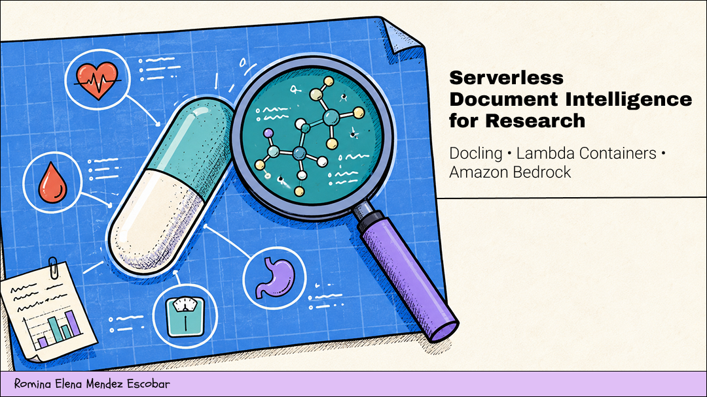
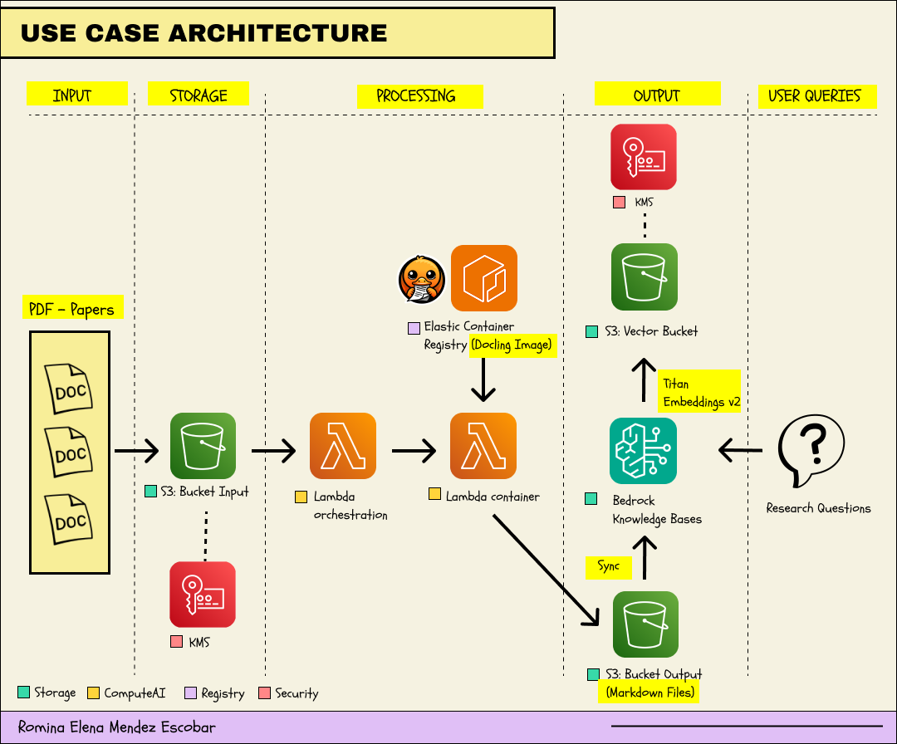

---

# Serverless Research Paper Intelligence: Docling, Lambda Containers, and Amazon Bedrock

---

# 1.🚀 Introduction
## The objective of the tutorial
The idea is not to build a generic search engine over the internet, but something much more interesting: a private knowledge base where you can query only your own research documents in a secure environment.
To solve this, we are going to build an architecture based on:
* 📦 AWS Lambda Containers
* 📑 Amazon Bedrock Knowledge Bases
* 🐣 PDF processing with Docling
* 🗑️ Storage in Amazon S3
* ✂️ Chunking strategies to improve information retrieval

During the tutorial, I will also show several real problems that I found while implementing this solution:
* 〰️ size limits in Lambda,
* 〰️ timeouts caused by model downloads,
* 〰️ Docker image optimization,
* 〰️ scientific document processing,
* 〰️and architecture decisions to keep a serverless and low cost approach.

The final objective will be to transform a set of scientific papers into a knowledge base that can be queried using natural language. This will allow us to ask questions about adverse effects, clinical criteria, study results, and comparisons between different research papers.

---

# 2.🧪 Use case
In this tutorial, we are going to work with a set of scientific papers related to research on **GLP-1 agonists (Glucagon-Like Peptide-1)**, a natural hormone involved in glucose regulation, insulin secretion, and the feeling of fullness.

In recent years, different treatments based on this family of molecules have appeared, and a large number of clinical studies, academic papers, and research documents have been published. These documents are related to cardiovascular outcomes, weight loss, adverse effects, and inclusion or exclusion criteria in clinical trials.

**The objective of this use case** is not to build a search engine over the internet or use public information in real time. The idea is to `work with a private and curated set of scientific documents`, simulating a scenario where researchers, medical teams, or research areas need to query only their own papers in a secure environment.

For this **MVP**, I am going to use 10 public papers as an example dataset, but the architecture is designed for scenarios where the documents can be private or belong to internal research processes.

From these documents, we are going to build a knowledge base that allows queries using natural language, for example:
* 〰️ identify adverse effects reported in different studies,
* 〰️ compare results between treatments,
* 〰️ validate exclusion criteria in clinical trials,
* 〰️ analyze cardiovascular outcomes,
* 〰️ retrieve specific information across multiple scientific papers.

---

# 3. 🏗️ Solution Architecture

Before going into the theoretical concepts, we are going to describe the solution that we will build.
This solution is based on a **serverless architecture** that processes scientific papers in `PDF` format and later uses them as input for an **Amazon Bedrock Knowledge Base** to build a `RAG` system.
The architecture clearly separates the **ingestion and processing flow** from the **intelligent query flow**, while keeping the solution simple and scalable.
The following blueprint shows how each component connects inside the complete pipeline.

In summary, this pipeline processes `PDF` files using a **Python based Docker image** with **Docling**, running inside a **container based Lambda**. This Lambda transforms the files into structured documents in `Markdown`.

Then, these documents are stored in **Amazon S3** and indexed by **Amazon Bedrock**, which generates `embeddings` and allows semantic queries over the content.
