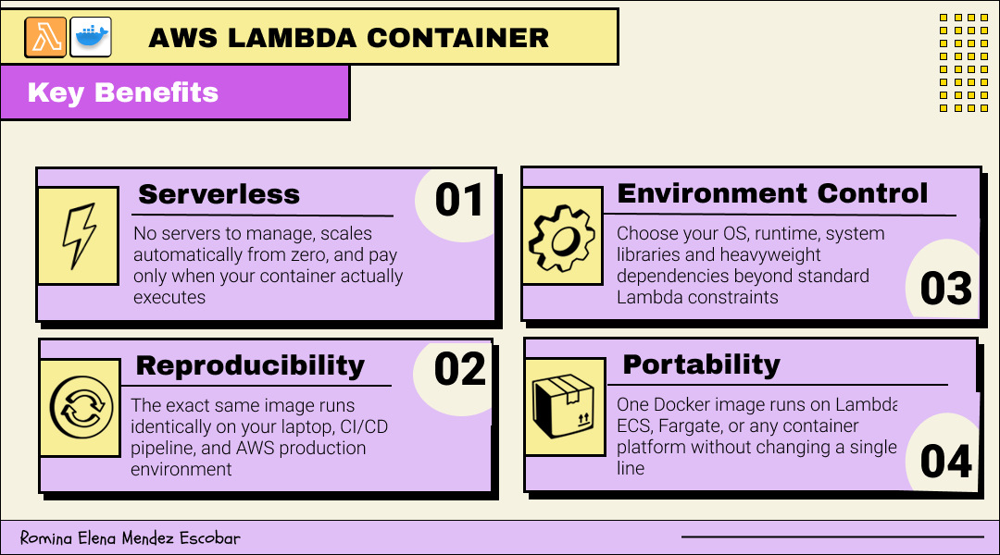
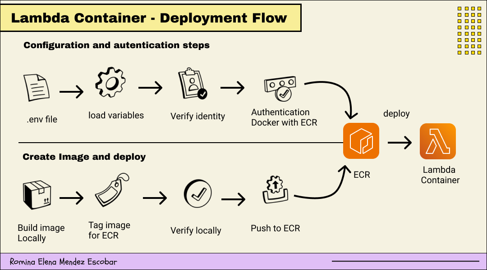

# 🐳 AWS Lambda Containers
To solve part of these limitations, **AWS Lambda** allows you to run functions using **container images** instead of `ZIP` packages.
This approach allows you to package the function as a **Docker image**, push it to **Amazon Elastic Container Registry**, and run it directly from **Lambda**.

The main advantage is that it significantly increases the size limit, up to around `10 GB`. This makes it possible to include heavy dependencies, predownloaded models, or complex libraries like **Docling** without needing workarounds with **Layers**.
In this project, this option is key because it allows us to run **Docling** inside **Lambda** without compromising dependencies or the `runtime`.

The following image summarizes the key benefits of using **Lambda Containers** for this type of workload.




---

## Deploying a Docling Lambda Container to AWS
We are going to use a **container based Lambda**. This allows us to package **Docling**, its dependencies, and its models inside a **Docker image**, and deploy it using **Amazon Elastic Container Registry** (`ECR`).
In this section, we are going to build the image, push it to **AWS**, and use it inside **Lambda** to process our scientific papers.
The following image shows the deployment flow that we will follow step by step.



### Prerequisites
Before starting, you need to have:
**AWS CLI** installed and configured 
**Docker** installed with `buildx` support 
Repository cloned locally 
**Amazon S3** bucket named `docling-papers-tutorial`, with the `PDFs` that we are going to process already uploaded 
You also need an **IAM user** with permissions to create images in **ECR** and deploy **Lambda** functions. In the repository, you will find `JSON` files with the required policies inside `iam/user_policies`.

### Building the Docker image
Once the repository is cloned, we start by configuring the environment variables required for the deployment.

#### Setup
Create a `.env` file with your credentials:
```bash
AWS_ACCESS_KEY_ID=your_access_key
AWS_SECRET_ACCESS_KEY=your_secret_key
AWS_DEFAULT_REGION=us-east-1
```
Luego exporta las variables:
```bash
export $(grep -v '^#' .env | xargs)
export AWS_ACCOUNT_ID=$(aws sts get-caller-identity \
--query Account --output text)
export ECR_REPO_NAME=docling-lambda
export LAMBDA_FUNCTION_NAME=docling-lambda
export IMAGE_NAME=docling-lambda
```
> ⚠️ Remember to add `.env` to your `.gitignore`.

#### Step 1: Verify your AWS identity
Before deploying, verify which **AWS account** and **IAM user** are currently configured in your environment.

```bash
aws sts get-caller-identity
```

#### Step 2: Authenticate Docker with Amazon ECR
This command generates a temporary **ECR authentication token** and passes it to `docker login`, so Docker can push images to your private **ECR registry**.

```bash
aws ecr get-login-password --region $AWS_DEFAULT_REGION | \
  docker login --username AWS --password-stdin \
  $AWS_ACCOUNT_ID.dkr.ecr.$AWS_DEFAULT_REGION.amazonaws.com
```
> ⚠️ This token expires after 12 hours. Run this step again if you get authentication errors.

#### Step 3: Build the Docker image

Now we build the Docker image from the `Dockerfile`.

```bash
docker buildx build \
  --platform linux/amd64 \
  --provenance=false \
  --sbom=false \
  --no-cache \
  --load \
  -t $IMAGE_NAME .
```
The most important flags are:

| Flag | Description |
| --- | --- |
| `--platform linux/amd64` | Forces the `x86_64` architecture required by AWS Lambda. This is required if you are building on an Apple Silicon Mac, such as M1, M2, or M3. |
| `--provenance=false` | Disables build attestation metadata, which can cause issues with Lambda image deployments. |
| `--sbom=false` | Disables Software Bill of Materials generation, which can also cause issues with Lambda deployments. |
| `--no-cache` | Builds the image from scratch, ignoring cached layers. |
| `--load` | Loads the image into your local Docker daemon after building. |
| `-t $IMAGE_NAME` | Tags the image with the selected image name. |

#### Step 4: Tag the image for ECR
Before pushing the image, we need to create a new tag that points to the full **ECR repository URI**.
Docker requires the image name to match the complete **ECR URI** before it can push the image to the registry.

```bash
docker tag $IMAGE_NAME:latest \
$AWS_ACCOUNT_ID.dkr.ecr.$AWS_DEFAULT_REGION.amazonaws.com/$ECR_REPO_NAME:latest
```

#### Step 5: Verify that the image exists locally
Before pushing the image to **ECR**, confirm that it exists in your local Docker environment.
```bash
docker images
```
The image should appear with both tags: the **local tag** and the **ECR tag**.

#### Step 6: Push the image to ECR
Now we push the image to your private **ECR repository**.

This step may take several minutes because the **Docling image** is large due to the `ML` models included inside the container.

```bash
docker push \
$AWS_ACCOUNT_ID.dkr.ecr.$AWS_DEFAULT_REGION.amazonaws.com/$ECR_REPO_NAME:latest
```


#### Step 7: Update the Lambda function
Run this step only if you need to update an existing **Lambda function** with a new image version.
```bash
aws lambda update-function-code \
--function-name $LAMBDA_FUNCTION_NAME \
--image-uri $AWS_ACCOUNT_ID.dkr.ecr.$AWS_DEFAULT_REGION.amazonaws.com/$ECR_REPO_NAME:latest
```
This command tells **AWS Lambda** to use the new image that you just pushed to **ECR**.
Lambda will pull the image from **ECR** and deploy it automatically.
